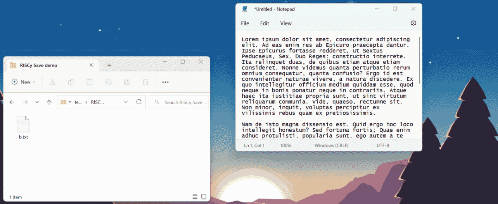

# RISCy Save

RISCy Save is an extension for Windows that enhances the standard open/save dialog boxes, inspired by [RISC OS](https://en.wikipedia.org/wiki/RISC_OS). Instead of navigating to a folder which you may already have open, you can drag-and-drop a file directly to its destination.

This works especially well with my file manager [ChromaFiler](https://chroma.zone/chromafiler/), which allows you to have a set of folders pinned to your taskbar for quick access.

The extension is compatible with any program that uses the common dialog boxes, including both the old Windows 95 style boxes and the modern Vista style.

RISCy Save is currently unfinished but the basic functionality is complete. At the moment you will need to build the source code yourself to try it. Check back soon for a downloadable version.
